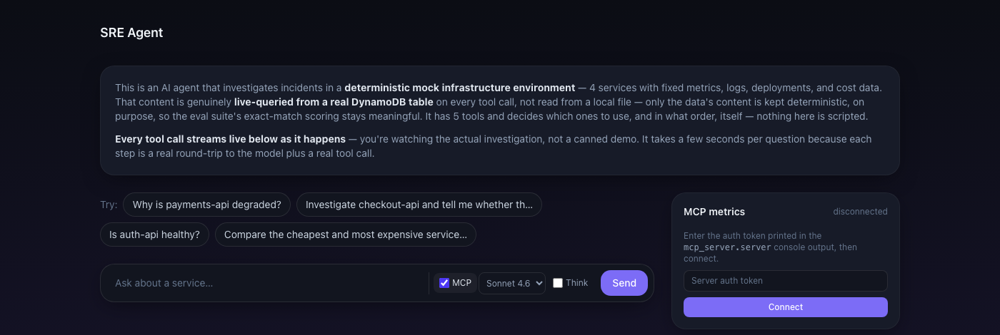

# SRE Investigation Agent: AgentCore + MCP observability

An incident investigation agent (5 tools, deterministic mock
infrastructure: payments-api, checkout-api, auth-api, notifications) on
Amazon Bedrock AgentCore Runtime, with its own MCP server for
per-prompt cost/token/tool-call metrics and a live-streaming chat UI.
Full design reasoning and history: `docs/PROJECT.md`. Working
conventions: `CLAUDE.md`.

[](https://github.com/sohaibsohail98/sre-investigation-agent/actions/workflows/tests.yml)
[](https://github.com/sohaibsohail98/sre-investigation-agent/actions/workflows/deploy-agentcore.yml)

## Run it locally

```sh
cd sre-investigation-agent
uv venv && source .venv/bin/activate && uv pip install -r requirements-dev.txt
uv run python -m scripts.dev_server
```

Runs the unit suite plus a live Bedrock connectivity check, then starts
`mcp_server.server` (`:8787`) and `web.server` (`:8788`, the chat UI).
No AWS account? Set `DEMO_MODE=1` first, it skips the Bedrock check and
replays pre-recorded investigations through the same code path
(`web/demo_replay.py`), so a fresh clone runs with zero live calls.



Open `http://127.0.0.1:8788/chat`: every tool call streams live as the
agent investigates, a model selector (Sonnet 4.6 / Haiku 4.5), and a
Thinking toggle for real Bedrock extended thinking.

An MCP toggle (off by default) reveals a connect panel, it does not
connect by itself. `mcp_server.server` prints a bearer token on
startup, paste it in and click Connect for a real MCP Streamable-HTTP
handshake, which populates recent sessions, tool/cost stats, and the
Context Window Explorer for the session just run. This panel is
read-only observability into past sessions; the chat calls the agent
directly and always works with MCP off, MCP here is how you inspect
what happened, not how the agent investigates. Full tool list, client
configs, and the auth model:
[`mcp-context-inspector`](https://github.com/sohaibsohail98/mcp-context-inspector#readme).

## Run the tests

```sh
uv run python -m pytest              # unit tests, no AWS calls, free
uv run python -m tests.run_eval      # 8 live scenarios, real Bedrock cost
```

Deterministic mock data keeps eval scoring reproducible run to run.
`tests/eval_results.json` has the last recorded 8/8 run.

## Deploy to AWS

```sh
./scripts/deploy.sh
uv run python -m scripts.invoke "Why is payments-api degraded?"
```

Full prerequisites and commands: `docs/DEPLOYMENT.md`. An idle
AgentCore runtime costs $0 (consumption-based), no cost reason to tear
it down between sessions.

## CI

`tests.yml` runs the unit suite on every push/PR. `deploy-agentcore.yml`
runs the live eval then deploys on every push to `main`, via AWS OIDC,
no stored keys. Both green, badges above.

## Known behavior worth knowing about

- The system prompt is principled, not scripted: answers are correct
  but not perfectly reproducible turn by turn. Eval scores on outcome,
  not exact tool-call sequence.
- `search_logs` matches substrings. `"Hit the turn limit without
  finishing"` means raise `MAX_TURNS` (default 15, env var override).
- See `docs/PROJECT.md`'s gotchas section for the
  `AWS_BEARER_TOKEN_BEDROCK` incident.

**Phase 7 (Azure AI Foundry port)** is not started, still deferred, see
`docs/PROJECT.md`.
