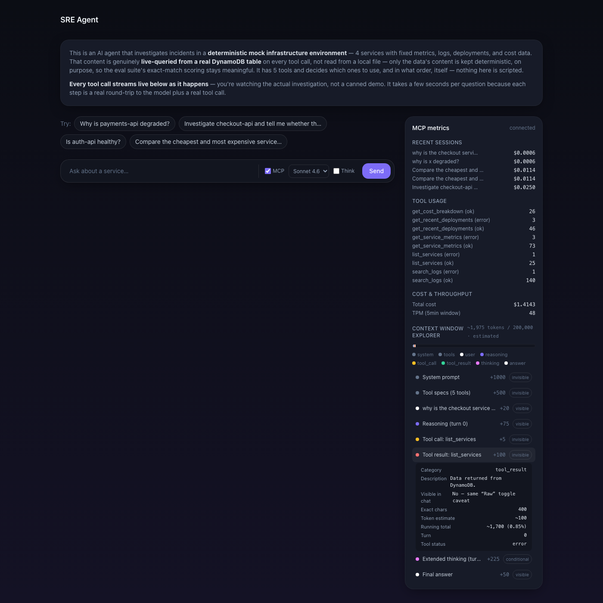

# SRE Investigation Agent — AgentCore + MCP observability

An incident-investigation agent (5 tools, deterministic mock
infrastructure data — payments-api, checkout-api, auth-api,
notifications) deployed on Amazon Bedrock AgentCore Runtime, with its
own MCP server for per-prompt cost/token/tool-call metrics and a
live-streaming chat UI that can open a real MCP handshake to show them
in an embedded panel.

**Full design reasoning, decisions, and history live in
`docs/PROJECT.md`.** This file is just "how do I run it" — everything
below is Phases 1–5, all built, tested, and deployed. See `CLAUDE.md`
for working conventions in this repo (notably: test after every feature,
not at the end).


The MCP panel's headline feature — the **Context Window Explorer** —
shows exactly what entered the model's context window, block by block,
with honest (labeled-estimated) token counts:



## Repo layout

```
agent/              runtime.py (boilerplate loop) + app.py (this agent's
                    config) + system_prompt.txt + Dockerfile
tools/              5 SRE tools, each with get_tool_spec() + implementation
data/               synthetic services/deployments/logs/costs (+ metrics.db
                    once you run it locally — gitignored)
web/                chat UI (:8788) — server.py + chat.html/js +
                    mcp-client.js (real MCP handshake for the metrics panel)
tests/              eval_scenarios.json (8 scenarios, live) + run_eval.py +
                    test_*.py (pytest, no live calls) + conftest.py
learn/              local_chat.py — Gradio dev loop, suggested prompts
terraform/          ECR + IAM + DynamoDB + the AgentCore runtime + ci.tf
                    (GitHub Actions OIDC role — applied, not yet wired up)
.github/workflows/  deploy-agentcore.yml — eval + deploy on push to main
docs/PROJECT.md     design reasoning, decisions, and history
docs/screenshots/   README screenshots
CLAUDE.md           working conventions for this repo
.env.example        documented env vars (no secrets — auth is your AWS creds)
```

The MCP server (`mcp_server/`) and execution-metrics recorder
(`metrics/`) used to live in this repo; they're now a standalone,
reusable package —
[`mcp-context-inspector`](https://github.com/sohaibsohail98/mcp-context-inspector)
— installed as a regular dependency (see `requirements-dev.txt` /
`agent/requirements.txt`). Same `python -m mcp_server.server` command,
same 7 tools, same import paths in `agent/app.py` — only where the code
physically lives changed.

## Prerequisites

- AWS credentials with Bedrock + AgentCore + ECR + DynamoDB access, and
  model access granted for `us.anthropic.claude-sonnet-4-6` (see
  `docs/PROJECT.md`'s "AWS/Bedrock gotchas" section if you hit
  `ValidationException` — there are two easy-to-miss traps documented
  there).
- `uv` (or plain `pip`) — Python 3.13+.
- Docker with buildx, for the deploy step only.
- Terraform >= 1.9, for the deploy step only.

```sh
cd aws-bedrock-project
uv venv                       # if .venv doesn't already exist
source .venv/bin/activate
uv pip install -r requirements-dev.txt
```

## 1. Run it locally (no AWS deploy needed)

```sh
uv run python -m learn.local_chat
```

Opens a Gradio chat UI backed by the exact same `agent/app.py` function
the deployed agent uses. Try: *"Why is payments-api degraded?"* or
*"Investigate checkout-api and tell me whether there is evidence of a
recent deployment causing the issue."* — the second one is the
deliberately-tricky negative case (no deployment exists for
checkout-api; a good answer traces it to the `inventory-service`
dependency instead).

Every message here writes a row to `data/metrics.db` (SQLite), same as
a real invocation — so the MCP metrics panel (§3) has something to show
after you've chatted with it a bit. The chat window shows clickable
suggested questions (`examples=`) pulled from `tests/eval_scenarios.json`
— same source the web chat UI (§3) uses, so both stay in sync
automatically.

## 2. Run the tests

```sh
uv run python -m pytest              # unit tests, no AWS calls, free
uv run python -m tests.run_eval      # 8 live scenarios, real Bedrock cost
```

`pytest` covers the loop mechanics, tool contracts, and both storage
backends (mocked, no AWS needed) — run this after any code change.
`run_eval.py` runs all 8 fixed scenarios from `tests/eval_scenarios.json`
against the live agent, scoring each on (a) whether the expected tools
were actually called and (b) whether key facts appear in the answer —
run this after any prompt or tool change, not every trivial edit. Should
print `8/8 scenarios passed`.

## 3. MCP server + chat UI

```sh
uv run python -m scripts.dev_server
```

**Use this, not a bare `python -m mcp_server.server` / `python -m
web.server`** — it runs the full unit suite and a live Bedrock
connectivity check first, then starts both servers as separate
processes, and refuses to start either if a check fails. This exists
because of a real incident:
a stray `AWS_BEARER_TOKEN_BEDROCK` env var (left over from testing a
Bedrock console API key) silently overrode working IAM credentials —
botocore does this automatically for any bedrock-runtime call the
moment that var is set anywhere in the environment, regardless of what
credentials were actually configured. The server started fine; every
chat request then failed with `"Bearer Token has expired"`. `agent/
runtime.py` now clears that env var defensively at import time (so this
specific failure can't recur), and the preflight check
(`tests/preflight_bedrock.py`) catches any *other* auth/connectivity
problem before you're mid-conversation, not during it. If you ever hit
this error again: `env | grep AWS_BEARER_TOKEN_BEDROCK` in the shell
you're launching from.

Starts two servers: `mcp_server.server` on `http://127.0.0.1:8787`
(protocol + metrics data access only) and `web.server` on
`http://127.0.0.1:8788` (the chat UI). Three ways to use it:

- **Chat**: open `http://127.0.0.1:8788/chat` — Tailwind CDN, no build
  step, with clickable suggested questions above the input, same
  4-question curated set as the Gradio loop's `examples=`. **Every tool
  call streams live** as the agent investigates (Server-Sent Events) —
  you see each tool it calls, its arguments, and its result the moment
  it happens, plus the model's reasoning between steps, not just a
  spinner then a final answer. Talks to `agent/app.py`'s
  `invoke_streaming()` directly, not through MCP — this is a
  webserver-reuse convenience, not a protocol claim. This is the
  "proper" chat UI (vs. Gradio being the fast local dev loop) — the one
  worth screenshotting.
  - Near the input: a **model selector** (Sonnet 4.6 / Haiku 4.5), a
    **Thinking** toggle (real Bedrock extended thinking — a genuine
    `reasoningContent` block, shown as a collapsible "Thinking…" panel,
    distinct from the plain narration text), and an **MCP server**
    toggle (off by default).
  - Turning the MCP toggle on **reveals a connect panel — it does not
    connect by itself.** `mcp_server.server` prints a bearer token to its
    own console on startup (a fresh random one each run, unless
    `MCP_AUTH_TOKEN` is set); paste that into the panel and click
    **Connect** to run a **real MCP Streamable-HTTP handshake** from the
    browser (`web/mcp-client.js` — genuine JSON-RPC framing against
    `mcp_server`'s `/mcp` endpoint, no SDK). Only once it reports
    "connected" does the right-side panel populate: recent sessions,
    aggregate tool/cost stats, and per-prompt detail (session vs. prompt
    metrics, per-turn context-%, cache-read tokens) for the session
    currently being chatted in. This mirrors adding an MCP server in
    Claude Desktop — connecting is a deliberate, authenticated action
    with a visible result, not a side effect of a checkbox. Note this
    panel is read-only observability into `data/metrics.db`'s full
    history (including past sessions), independent of the chat itself —
    the chat calls the agent directly and always works with the MCP
    toggle off; MCP here is a way to *inspect* what happened, not how
    the agent investigates.
- **MCP tools**: point any MCP client (Claude Desktop, Cursor, this
  session) at `http://127.0.0.1:8787/mcp` — 7 tools:
  `get_session_metrics`, `get_token_breakdown`, `get_tool_metrics`,
  `get_agent_trace`, `get_cost_estimate`, `get_recent_sessions`,
  `get_context_timeline`. Plain REST equivalents (`/api/sessions`,
  `/api/tool-metrics`, `/api/cost`, `/api/context-timeline/{session_id}`)
  are also exposed — a curl-friendly debugging alternative to a full MCP
  handshake, calling the same underlying `metrics/store.py` functions.

Example Claude Desktop config entry:
```json
{
  "mcpServers": {
    "sre-agent-metrics": { "url": "http://127.0.0.1:8787/mcp" }
  }
}
```
(No auth — this is the local, single-user design, deliberately kept
small. See `docs/PROJECT.md`'s "Deferred" section for what a real
multi-user version was speculatively scoped to need, and why it isn't
part of this project's direction.)

## 4. Deploy to AWS (Bedrock AgentCore)

```sh
cd terraform
terraform init                 # first time only

# 1. Infra first (the runtime needs an image to already exist)
terraform plan -target=aws_ecr_repository.agent \
  -target=aws_ecr_lifecycle_policy.agent \
  -target=aws_dynamodb_table.metrics \
  -target=aws_iam_role.runtime \
  -target=aws_iam_role_policy.runtime \
  -out=infra.tfplan
terraform apply infra.tfplan

# 2. Build + push (ARM64 — AgentCore requires it)
cd ..
aws ecr get-login-password --region us-east-1 | \
  docker login --username AWS --password-stdin \
  <your-account-id>.dkr.ecr.us-east-1.amazonaws.com
docker buildx build --platform linux/arm64 \
  -f agent/Dockerfile \
  -t <your-account-id>.dkr.ecr.us-east-1.amazonaws.com/sohaib-bedrock-agentcore:sre-agent \
  --push .

# 3. The runtime itself
cd terraform
terraform plan -out=runtime.tfplan
terraform apply runtime.tfplan
```

Invoke it (swap in the ARN from `terraform output agent_runtime_arn`):
```sh
uv run python -c "
import boto3, json, uuid
c = boto3.client('bedrock-agentcore', region_name='us-east-1')
resp = c.invoke_agent_runtime(
    agentRuntimeArn='<paste ARN here>',
    runtimeSessionId=str(uuid.uuid4()).replace('-', '') + 'abcdefgh',
    payload=json.dumps({'prompt': 'Why is payments-api degraded?'}).encode(),
    contentType='application/json', accept='application/json',
)
print(resp['response'].read().decode())
"
```

Deployed, the agent writes metrics to **DynamoDB** instead of SQLite
(`STORAGE_BACKEND=dynamodb`, set automatically via Terraform) — this
switch is mandatory, not optional, because AgentCore's container
filesystem doesn't persist across invocations (see `docs/PROJECT.md`'s
Storage section for why). The MCP server/chat UI still run locally
against that same DynamoDB table if you point `metrics/store.py` at it
(`STORAGE_BACKEND=dynamodb METRICS_TABLE=sre-agent-metrics uv run python -m scripts.dev_server`).

## 5. Tear down (optional — not required for cost reasons)

AgentCore Runtime is purely consumption-based, verified against AWS's
own pricing page: **an idle-but-registered runtime costs $0** — billing
only starts when a session actually runs. DynamoDB on-demand is the
same story. The only thing that ticks regardless of use is ECR image
storage (~5p/month, negligible). So there's no real cost reason to tear
down between sessions — leave it deployed if you want it sitting there
ready to test. Tear down if you'd rather not have it lying around for
other reasons (tidiness, or you're switching to a different image tag
and don't want two runtimes):

```sh
cd terraform
terraform plan -destroy -out=destroy.tfplan
terraform apply destroy.tfplan
```

This removes the runtime, ECR repo, DynamoDB metrics table, and IAM
role. The Terraform state backend (S3 bucket + DynamoDB lock table) is
infrastructure for Terraform itself, not this project — it's cheap
enough ($0-ish) to just leave alone.

## 6. CI pipeline (GitHub Actions) — written, not yet wired up

`.github/workflows/deploy-agentcore.yml` runs the eval suite then
deploys on every push to `main` (or manually via the Actions tab). Uses
AWS OIDC — no stored AWS keys in repo secrets. **Three things need doing
once, before this actually runs:**

1. **Confirm `terraform/variables.tf`'s `github_repo` variable** matches
   the real `owner/repo` this gets pushed to (currently defaults to
   `sohaibsohail98/aws-bedrock-project` — a placeholder, not confirmed).
2. **`terraform/ci.tf` is already applied** (the IAM role GitHub Actions
   assumes via OIDC) — get its ARN with `terraform output
   github_actions_role_arn`. Only re-apply if you change `github_repo`.
3. **Set the repo secret** `AWS_GITHUB_ACTIONS_ROLE_ARN` to that output,
   in GitHub repo Settings → Secrets and variables → Actions.

## Before you push this to GitHub — status of the account-ID decision

This repo is public. The real AWS account ID (`901876312125`) has been
scrubbed from this README's example commands (replaced with
`<your-account-id>`) — that was the only place it was decorative prose.
It's genuinely narrow: two other files still reference it, and neither
is a scrub candidate —

- `terraform/main.tf`'s S3 state-bucket name and `terraform/ci.tf`'s
  matching IAM policy ARNs — the bucket already exists in AWS with that
  literal name; this isn't decorative, Terraform needs the real value to
  function. Renaming it means an actual state migration (create a new
  bucket, migrate state, delete the old one), not a text edit — real
  infrastructure surgery, not a pre-push formality, so it's left as-is.

An account ID isn't a credential on its own — it can't be used to
access anything — so this is a mild account-identifying/OSINT
consideration, not a security hole. `docs/PROJECT.md`'s history
separately documents that AWS **root** credentials were used locally for
speed early on (an explicit, deliberate tradeoff at the time, not an
oversight) — worth knowing that's in the history too.

## Known behavior worth knowing about

- The system prompt is deliberately **principled, not scripted** — it
  doesn't dictate tool-call order. This means answers are correct but
  not perfectly reproducible turn-by-turn (the model might check logs
  before metrics one run, the reverse the next). The eval suite scores
  on outcome (right tools used, right facts stated), not exact sequence.
- `search_logs` matches substrings — the prompt nudges the model to
  search efficiently rather than probe many single words one at a time;
  if you see `"Hit the turn limit without finishing"`, that's what's
  going wrong, and `MAX_TURNS` (default 10, env var override) is the
  knob if it recurs after a prompt change.

## Not built

**Phase 6 (CI/CD)** is written and the AWS side is applied, but the repo
secret still needs setting — needs the setup steps in §6 above before it
actually runs on push.

**Phase 7 (Azure AI Foundry port)** — genuinely not started, still
deferred. See `docs/PROJECT.md` for the full deferred/not-built list.
